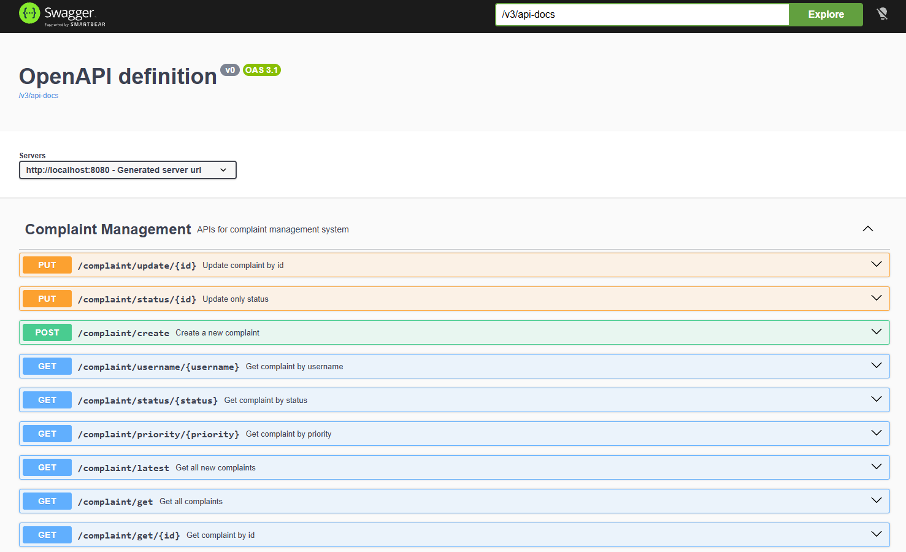
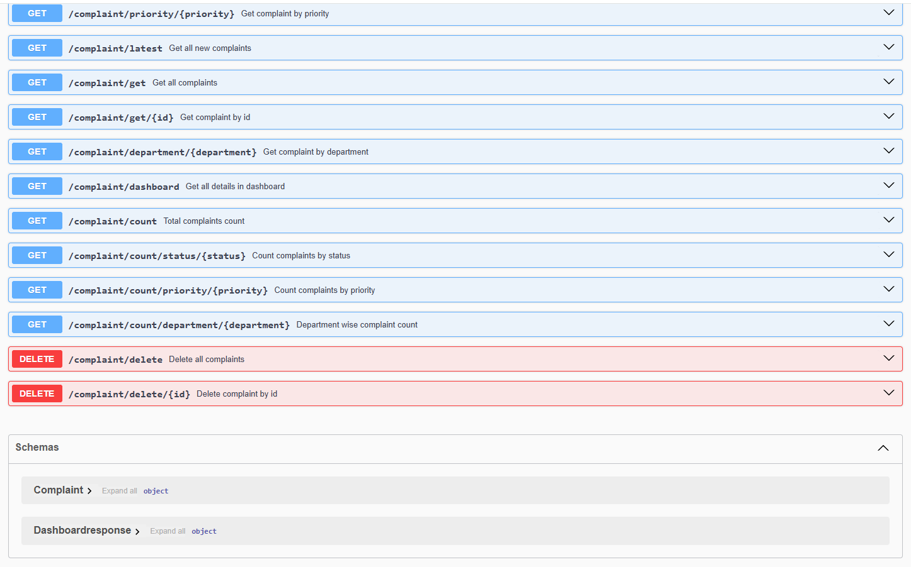
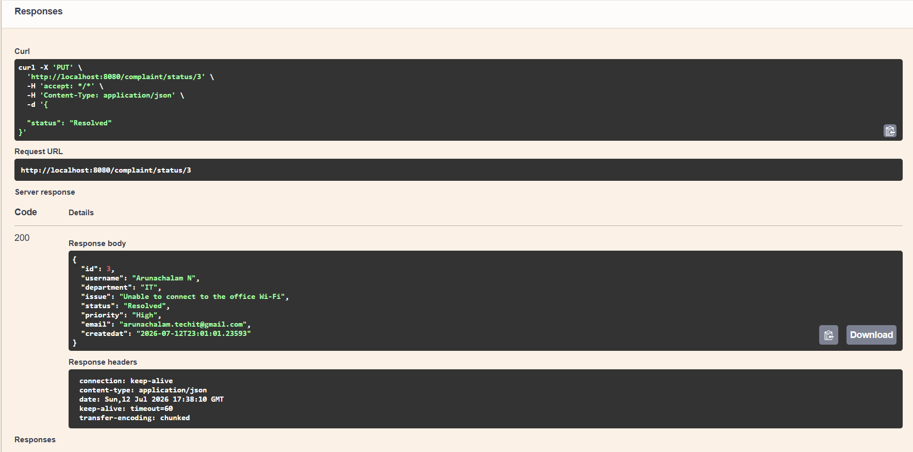
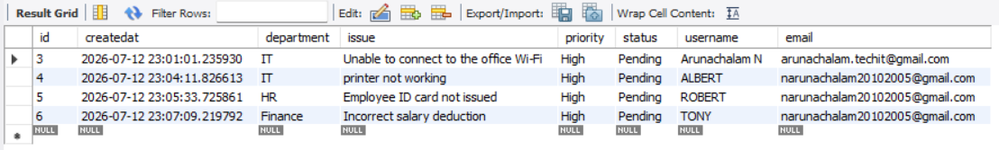
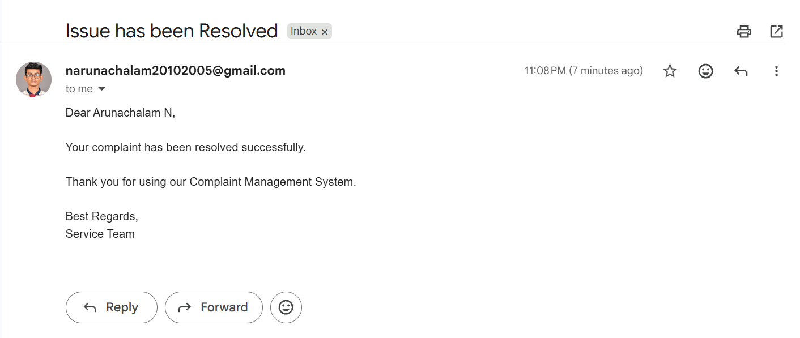

# Complaint Management System

## Features
- Complaint creation and tracking
- CRUD operations
- Dashboard APIs
- Email notifications
- Swagger API documentation
- Input validation
- MySQL database integration

## Technologies Used
- Java
- Spring Boot
- Spring Data JPA
- MySQL
- Swagger OpenAPI
- Java Mail Sender

## Screenshots

### Swagger UI - Main APIs

### Swagger UI - Additional APIs

### Complaint API Response

### MySQL Database

### Email Notification
